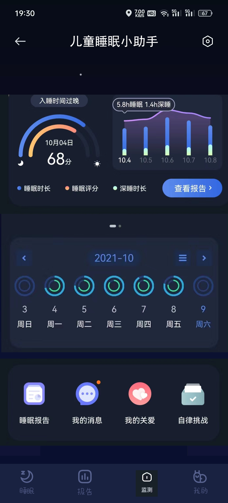
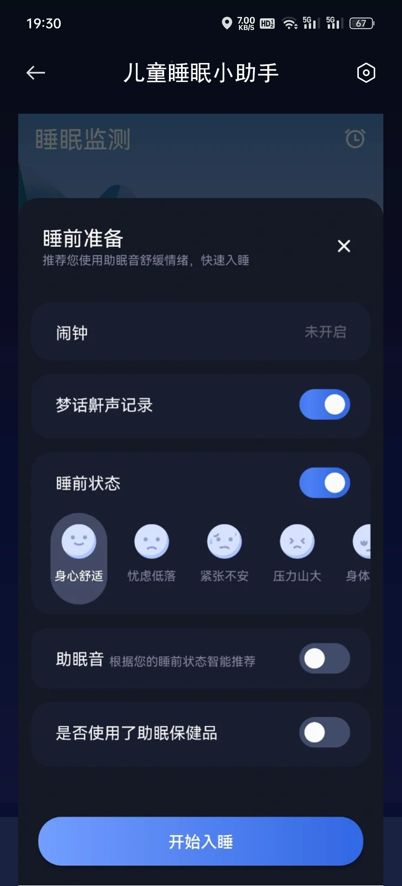
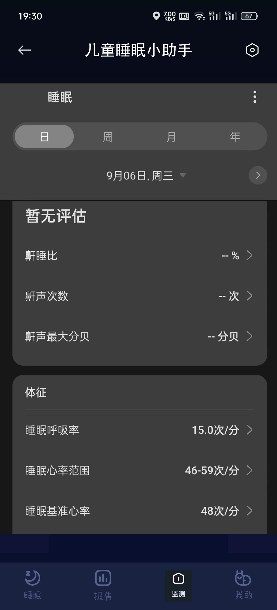
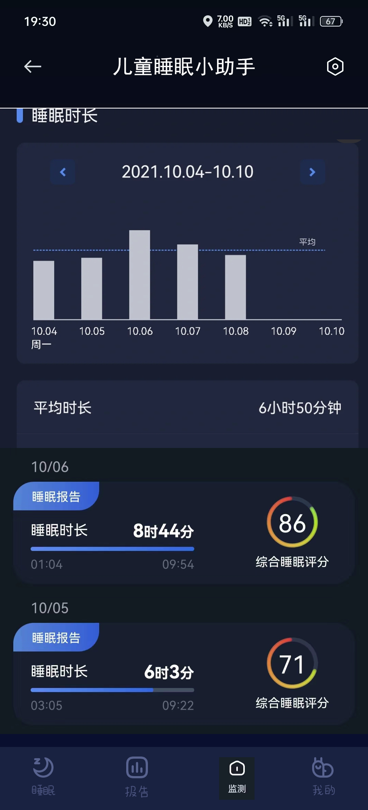

# Adolescent-Sleep：青少年睡眠与脑机多模态分析
## 基于脑电信号与深度学习的情绪识别研究
1.HOG+SVM需要在服务器上跑，image文件夹放测试集，image128放训练集，不建议跑这个，可以找更轻量一点的代码尝试

2.image_class-master是github上比较出名的一套开源深度学习代码，拿来自己改，做三分类四分类都可以，data文件夹里面放图片数据集，config文件里面自己设置训练参数，有注释

3.Python-Image-feature-extraction-master提取纹理特征代码，写了一套自动纹理特征提取的脚本，可批量产出

### 注意事项
1.你的图片长宽可以不相等，设置好image_height和image_width即可。如果图片大小不相等，可以使用change_size.py，把所有图片大小resize成一样的。

2.你图片对应的标签必须是这样的
  ```txt
  001.jpg 1
  003.jpg 2
  ```
前面是图片名称，后面是对应的类别（类别用数字表示），中间要用空格隔开，每个标签占一行。
需要准备两个文件，一个是训练用的，一个是测试用的。
训练样本标签和预测的都是一样的格式
可以看上面的实例.(image文件夹)

3.你的训练和测试的图片可以放在同一个文件夹下面，也可以不同，设置好`train_image_path`和`test_image_path`即可。

4.你要根据你图片的大小，对这行代码进行一些调整，这个调整需要你先了解hog的知识：
`fd = hog(gray, orientations=18, pixels_per_cell=[8,8], cells_per_block=[4,4], visualise=False, transform_sqrt=True)`
这是为128x128大小图片设置的提取hog特征的参数，可以适当改变一些，到时候的效果也不同。
`orientations`可以选9或18，即梯度方向的个数
一般来说，图片越大，`pixels_per_cell` 和`cells_per_block`里面的值可以相应变大。

5.如果你要进行多次，建议你把文件位置的参数写死
  ```python
  #训练集图片的位置
  train_image_path = '/home/icelee/Downloads/dataset/small_shixun/'
  #测试集图片的位置
  test_image_path = '/home/icelee/Downloads/dataset/small_shixun/'
  #训练集标签的位置
  train_label_path = '/home/icelee/Downloads/dataset/mydata.txt'
  #测试集标签的位置
  test_label_path = '/home/icelee/Downloads/dataset/test.txt'
  #图片大小
  image_height = 128
  image_width = 128
  ```
6.你需要安装sk-learn库，hog，PIL库等。可能还有一些零碎的库，大家用pip安装就好。

7.实验都是彩色图片，如果你的图片是纯黑白的，很有可能需要改一下代码，看一下代码注释即可

8.[VGG16模型下载地址](https://github.com/fchollet/deep-learning-models/releases/)放在image_class-master/checkpoints/VGG16/文件夹下

9.[VGG19模型下载地址](https://github.com/fchollet/deep-learning-models/releases/download/v0.1/vgg19_weights_tf_dim_ordering_tf_kernels_notop.h5)
放在image_class-master/checkpoints/VGG19/文件夹下
## 儿童睡眠小助手微信小程序
<center>
    
</center>
